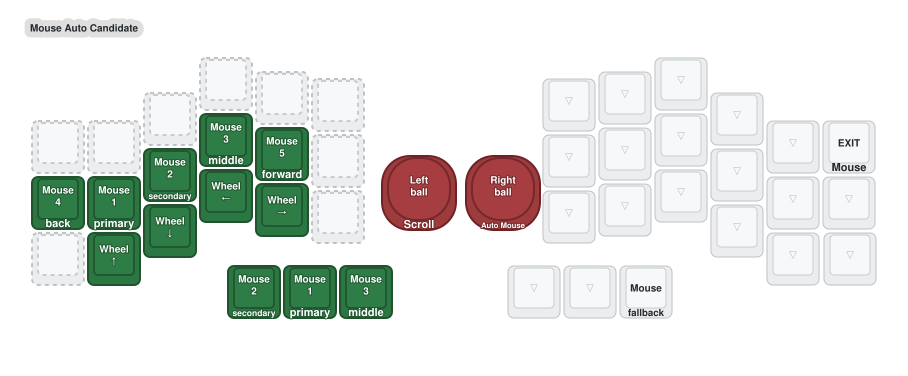

# Auto Mouse candidate — right ball plus left mouse controls

Status: Hardware-verified and retained
Firmware changed: yes, in `config/crosses.keymap`
KeyPeek changed: no
Hardware result: flashed by Max; currently works great (2026-09-01)

## Intended interaction

```text
move right ball
    ↓
Mouse layer activates for about 1000 ms
    ↓
KeyPeek displays the Mouse layer
    ↓
left home row = Mouse 4 / 1 / 2 / 3 / 5
left bottom row = wheel directions
left thumbs = Mouse 2 / Mouse 1 / Mouse 3
    ↓
continued ball movement refreshes the timeout
```

Grid Jump is removed from the candidate. The left home row becomes a conventional
five-button mouse strip, the bottom row provides discrete wheel directions, and
the top row is intentionally reserved until real use demonstrates another need.
The left thumb cluster provides direct clicks, with primary click in the center
Space position for the easiest hold-drag posture. The right half remains mostly
transparent so it does not duplicate the control surface.



## Retained firmware mechanics

- Run the temporary-layer processor through a central-only motion gate on the
  right trackball listener before report-rate limiting.
- Target `MOUSE` with a 1000 ms timeout.
- Require 500 ms prior idle and six cumulative X/Y counts within 80 ms before
  layer activation. Pointer motion itself is never discarded.
- Keep the left trackball's peripheral scroll conversion unchanged.
- Remove all 18 Grid Jump host events from the experimental Mouse layer. The
  external AHK helper is not needed for this workflow.
- Exclude the left click and wheel positions from press-to-dismiss so clicking,
  dragging, and repeated scrolling do not end Mouse prematurely.
- Preserve the existing Base Mouse thumb as a manual fallback unless daily use
  demonstrates that it is redundant.

## KeyPeek behavior

No new KeyPeek feature should be necessary:

- The temporary-layer processor activates Mouse through the normal ZMK layer
  state.
- `zmk-keypeek-layer-notifier` already subscribes to every
  `zmk_layer_state_changed` event and sends the complete active-layer mask.
- KeyPeek already resolves the `Mouse` display name and is configured to remain
  visible while a non-base layer is active.
- Ball motion refreshes the firmware timeout without sending repeated layer
  changes; KeyPeek should receive activation once and deactivation once.

The connected keyboard test succeeded. KeyPeek continues to expose the normal
Mouse layer state without a separate desktop implementation.

## Deliberate return-to-typing delay

Max accepts that left-side typing may remain unavailable for the one-second
Mouse tail after the last ball movement. This turns the timeout from an
accidental-capture problem into an intentional mode boundary: KeyPeek shows
Mouse during the tail, then disappears when Base is restored.

The 500 ms prior-idle guard plus the motion gate prevents incidental ball or
keypress vibration from entering Mouse while typing is underway. Transparent
right-side keys may dismiss Mouse early if the temporary-layer behavior allows
that cleanly in the compiled result; this is a convenience, not a requirement.

## Thumb order selected for the candidate

The drawing uses a frequency-optimized order:

| Left thumb position | Candidate action |
|---|---|
| 36, outer | Mouse 2 |
| 37, center / Space position | Mouse 1 |
| 38, inner / Sym position | Mouse 3 |

This intentionally differs from the current Nav order. Mouse 1 is the most
frequent action and the one held for dragging, so it gets the easiest center
thumb position. The old Nav click duplicates can be reconciled only after the
new Mouse workflow proves comfortable.

## Hardware result

- Both halves compiled, and the right/central artifact was flashed by Max.
- Intentional Auto Mouse use and the vibration gate currently work great.
- No settings reset, Bluetooth re-pairing, or left-half flash was needed.
- Treat the current thresholds as the hardware-verified baseline. Change only
  one value at a time if a concrete failure emerges later.

## Compile verification

- Right/central firmware compiled successfully with the temporary-layer
  processor enabled.
- Compiled devicetree confirms Mouse layer `3`, timeout `1000 ms`, prior-idle
  guard `500 ms`, activation threshold `6`, window `80 ms`, the intended
  excluded click/wheel positions, and gated temporary-layer processing before
  report-rate limiting.
- Left/peripheral firmware also compiled successfully. Its central listener is
  disabled as expected, so left-ball scroll processing remains unchanged.
- Candidate UF2 files were generated separately; the pre-existing root UF2
  files were not overwritten.
