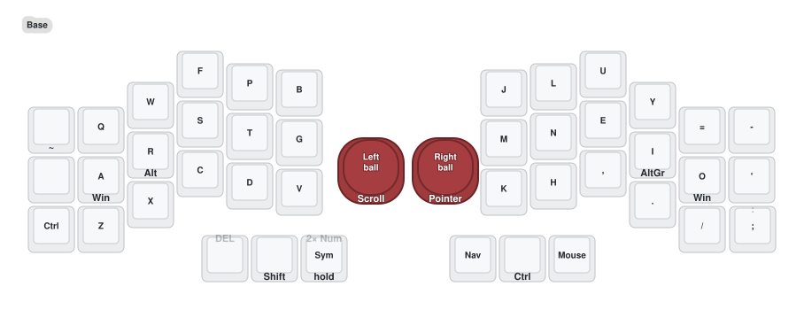
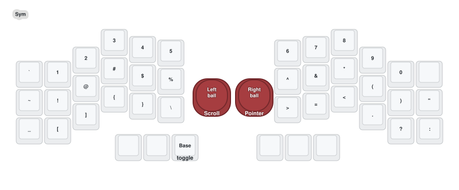
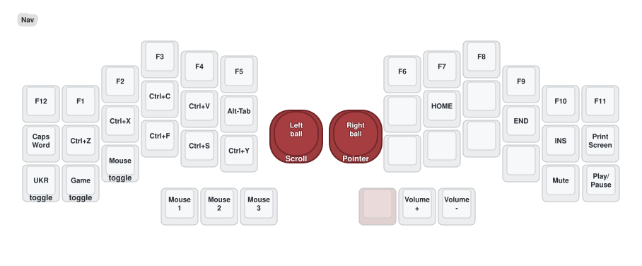
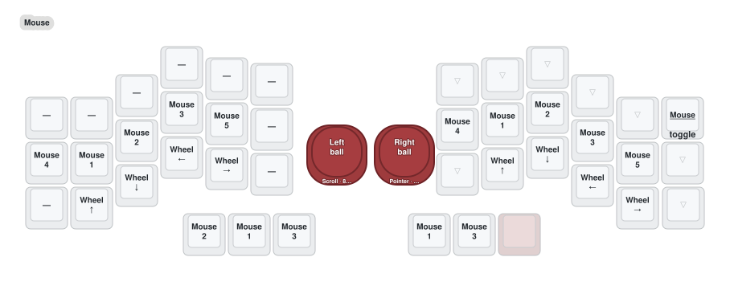
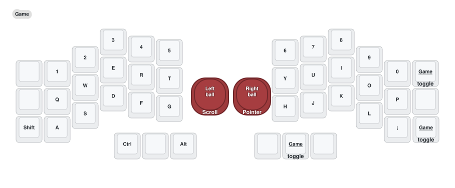
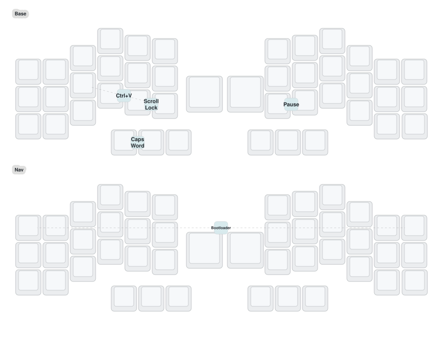

# Crosses 42

Personal ZMK configuration for Max's 42-key wireless split keyboard with two
PMW3610 trackballs. The right half is the central half and provides USB,
ZMK Studio, and KeyPeek's Raw HID connection.

The active firmware source is [`config/crosses.keymap`](config/crosses.keymap).
It takes precedence over screenshots, historical stage notes, and any
per-position overrides previously written by ZMK Studio.

## Start here: the daily model

Most work should fit into four actions:

1. Type on **Base**.
2. Hold the left inner **Sym** thumb for numbers and punctuation; double-tap it
   for a temporary NumWord run.
3. Hold the right inner **Nav** thumb for editing, arrows, function keys,
   Alt-Tab, and media.
4. Move the right ball to enter Auto Mouse, then use the left home row or
   thumbs for clicks. The left ball scrolls on every layer.

The two persistent special-purpose layers—**UKR** and **Game**—are entered from
Nav and have explicit exit keys.

## Layer guide

| Layer | What it is for | Learn these first |
|---|---|---|
| **Base** | Colemak-DH typing | Win/Alt home-row modifiers; plain S/T/N/E; `Backspace / Delete`; `Space / Shift`; three layer thumbs |
| **Sym** | Numbers and punctuation | Hold Sym for a few symbols; double-tap Sym for NumWord; press the Base key shown on Sym to leave |
| **Nav** | Editing and system navigation | Undo/Cut/Copy/Paste; arrows; Alt-Tab; Find/Save/Redo; volume |
| **Mouse** | Automatic pointing controls | Move the right ball; center-left thumb is primary click; home row provides five buttons |
| **UKR** | Timing-free Ukrainian positions | Switch Windows to Ukrainian first; enter from Nav; use the top-left key to exit |
| **Game** | Timing-free QWERTY | Enter from Nav; use any displayed `EXIT` key when finished |

### Base

Home-row holds provide Win/Alt on A/R/I/O. S/T/N/E are plain keys; Ctrl and
Shift retain dedicated alternatives. The left Space thumb becomes Shift when
held. The left trackball scrolls; the right trackball moves the pointer.

### Sym

Hold Sym for momentary access. Double-tap the same thumb to start NumWord;
NumWord ends automatically when a non-number/non-continuation key is pressed.

### Nav

Nav is the preferred editing surface: clipboard actions on the left, movement
on the right, plus function keys, Alt-Tab, media, and entry to Mouse, UKR, and
Game.

### Mouse

Move the right trackball and Mouse activates for about one second; continued
motion refreshes it. The left home row provides Mouse 4/1/2/3/5, the bottom row
provides wheel directions, and the left thumbs provide Mouse 2/1/3 with primary
click in the center Space position. Grid Jump has been removed.

A six-count/80 ms motion gate plus a 500 ms prior-idle guard prevents ordinary
keypress vibration from raising Mouse. Manual hold/toggle access remains
available from Base/Nav, with the top-right Mouse key as the toggle exit.

### UKR

The firmware layer and the Windows input language are separate. Use one ritual:

1. Switch Windows to Ukrainian with `Win+Space`.
2. Hold Nav and toggle UKR.
3. Type while both states are active.
4. Toggle UKR off, then switch Windows back to English.

The rare `Ґ` path is under verification and is intentionally not taught here:
static layer resolution suggests the active UKR layer may mask the lower Sym
binding previously documented for it.

### Game

Game is plain QWERTY with dedicated modifiers and no home-row or thumb timing
decisions. Unused right-side positions are blocked so Base behaviors cannot
leak through.

## Useful gestures

| Gesture | Result |
|---|---|
| Backspace + Space thumbs | Caps Word |
| Both outer top corners while holding Nav | Bootloader |
| Base `D + V` positions | Show Mouseless overlay (`Scroll Lock`) |
| Base `K + H` positions | Toggle Mouseless free mode (`Pause/Break`) |
| Base `R + V` positions | Direct `Ctrl+V` |

[Open the combined six-layer map](keymap-drawer/crosses.svg).

## KeyPeek

[KeyPeek](https://github.com/srwi/keypeek) shows the active ZMK layer on
Windows through Raw HID. This configuration also uses a Crosses-specific
KeyPeek fork for custom behavior labels and an app-aware hotkey coach.

See [`KEYPEEK_SETUP.md`](KEYPEEK_SETUP.md) for installation and connection
details. The live KeyPeek configuration under `%APPDATA%` is authoritative;
the repository JSON is only a first-run template.

## Hardware and firmware

| Item | Current configuration |
|---|---|
| Keyboard | 42-key wireless Crosses split |
| Controllers | nice!nano-class; right half central |
| Right PMW3610 | Pointer, 700 CPI |
| Left PMW3610 | Vertical/horizontal scrolling, 800 CPI |
| Host workflow | Windows, English and Ukrainian layouts |
| Active firmware checkpoint | Hardware-verified working tree, 2026-09-01; source checkpoint pending |

The build matrix produces left, right, and settings-reset artifacts. For the
validated build commands, flashing sequence, BLE recovery procedure, and ZMK
Studio NVS warning, use [`AGENT_HANDOFF.md`](AGENT_HANDOFF.md). Do not use the
settings-reset image for an ordinary keymap update.

## Project references

- [`KEYBOARD_UX_PLAN.md`](KEYBOARD_UX_PLAN.md) — durable improvement roadmap
- [`KEYBOARD_UX_AUDIT.md`](KEYBOARD_UX_AUDIT.md) — source-derived layer,
  combo, behavior, pointing, and UX audit
- [`AGENT_HANDOFF.md`](AGENT_HANDOFF.md) — build, flash, recovery, and
  hardware-history handoff
- [`keymap-drawer/crosses.yaml`](keymap-drawer/crosses.yaml) — parsed diagram
  source; generated from the active keymap

## Upstream modules and credits

- [ZMK](https://github.com/zmkfirmware/zmk)
- [Crosses shield support](https://github.com/Good-Great-Grand-Wonderful/gggw-zmk-keebs)
- [ZMK Raw HID](https://github.com/zzeneg/zmk-raw-hid)
- [KeyPeek layer notifier](https://github.com/srwi/zmk-keypeek-layer-notifier)
- [ZMK auto-layer / NumWord](https://github.com/urob/zmk-auto-layer)
- [ZMK tri-state](https://github.com/dhruvinsh/zmk-tri-state)

The UX rule for future changes is: **teach first, measure second, simplify one
workflow at a time**. Firmware and KeyPeek experiments remain separate and are
not flashed or installed without explicit approval.
